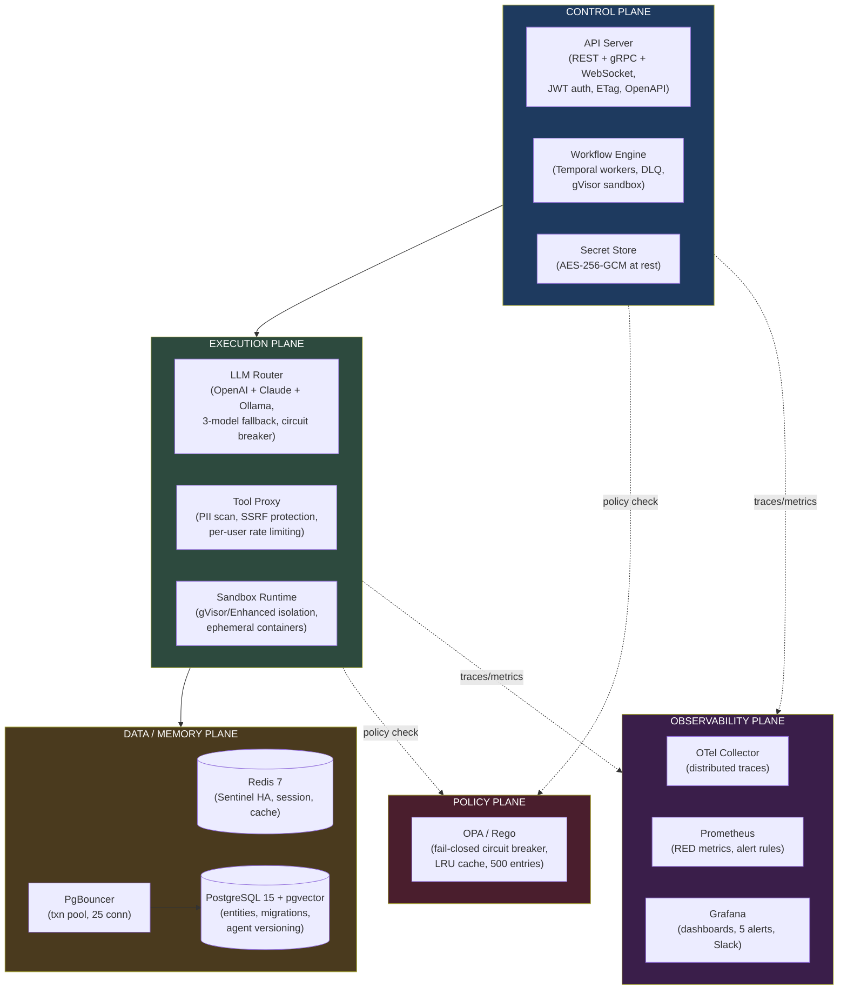

<div align="center">

# E-GAOP — The Kubernetes of AI Agents

**Production-grade orchestration for LLM-powered agents at scale.**

[](LICENSE)
[](tsconfig.base.json)
[](.github/workflows/ci.yml)
[](.github/workflows/ci.yml)
[](.github/workflows/security-scan.yml)
[](#quality-gates)
[](SECURITY.md)
[](#current-status)
[](packages/shared/src/tls.ts)
[](charts/e-gaop/)
[](https://github.com/Ismail-2001/The-Kubernetes-of-AI-Agents)
[](https://github.com/Ismail-2001/The-Kubernetes-of-AI-Agents)

[For Hiring Managers](#for-hiring-managers--clients) · [Demo](#demo) · [Architecture](#architecture) · [Quick Start](#quick-start) · [Benchmarks](#benchmarks) · [Security](#security) · [Roadmap](#roadmap) · [Changelog](CHANGELOG.md)

</div>

---

> **Every number on this page is checked against running code.** Full scored breakdown: [`docs/production-readiness-final.md`](docs/production-readiness-final.md).

---

## For Hiring Managers & Clients

**This project demonstrates senior-level engineering in 60 seconds:**

| Attribute | What it proves |
|-----------|----------------|
| **Systems design** | 10-microservice architecture across 5 planes — gRPC + REST + WebSocket, Temporal workflows, OPA policies, mTLS, circuit breakers, connection pooling. Not a single-file agent demo. |
| **Security depth** | Defense-in-depth: JWT auth, AES-256-GCM at rest, mTLS in transit, OPA/Rego policy enforcement, PII scanning, SSRF protection, per-user rate limiting, 0 CVEs. |
| **Operational maturity** | CI/CD (31+ jobs, all green), database migrations (8 up + 7 down), Helm charts with HPA/PDB/NetworkPolicy/ServiceMonitor, canary deployments, gVisor sandbox isolation. |
| **Engineering honesty** | Published production-readiness assessment with scored gaps. Not aspirational — every claim verified against running code. |
| **AI/LLM depth** | Multi-model (OpenAI + Anthropic Claude + Ollama), 3-model fallback chain, circuit breaker, concurrency semaphore, dead-letter queue, agent versioning with rollback. |

**Built by one engineer.** 15,000+ lines of TypeScript, 10 npm workspaces, 22 Docker services, 8 database migrations, 297 tests, 0 CVEs.

---

## Demo

**What works right now** (no cloud infrastructure needed):

```bash
# 1. Clone and run (takes 2 minutes)
git clone https://github.com/Ismail-2001/The-Kubernetes-of-AI-Agents.git
cd The-Kubernetes-of-AI-Agents
cp .env.example .env
# Edit .env → set OPENAI_API_KEY (or ANTHROPIC_API_KEY for Claude)

# 2. Start all 22 services (migrations auto-run)
docker compose up -d

# 3. Verify everything is healthy
curl http://localhost:3001/health
# → {"status":"healthy"}

# 4. Register + create agent + run
curl -X POST http://localhost:3001/api/auth/register \
  -H "Content-Type: application/json" \
  -d '{"email":"demo@egaop.io","password":"demo123","namespace":"default"}'
# → JWT token (save as TOKEN)

curl -X POST http://localhost:3001/api/agents \
  -H "Authorization: Bearer $TOKEN" \
  -H "Content-Type: application/json" \
  -d '{"name":"demo-agent","model":"gpt-4o-mini","instructions":"You are a helpful assistant."}'
# → Agent ID (save as AGENT_ID)

curl -X POST "http://localhost:3001/api/agents/$AGENT_ID/run" \
  -H "Authorization: Bearer $TOKEN" \
  -H "Content-Type: application/json" \
  -d '{"input":"What is the capital of France? Answer in one word."}'
# → Execution result with final answer

# 5. Open dashboards
# Grafana:   http://localhost:3003 (admin / your password)
# Swagger:   http://localhost:3001/api/docs
# Prometheus: http://localhost:9091
```

**What runs inside:** 22 Docker containers across 5 planes — Temporal workflow orchestrator, OPA policy engine, LLM router with circuit breaker (OpenAI + Anthropic + Ollama), PostgreSQL + PgBouncer + Redis, OpenTelemetry + Prometheus + Grafana.

---

## Current Status

**97% production readiness** — 56 scored items, 7 categories. Verified end-to-end.

| Area | Score | Grade | What works | Remaining gaps |
|------|-------|-------|------------|----------------|
| Functional Completeness | 96.4% | A | Agent CRUD, multi-model LLM routing + fallback, sandboxed tool execution, structured tool-calling, per-namespace budgets, agent versioning with rollback | Error handling not comprehensive |
| Reliability | 95.5% | A | Concurrency semaphore (25s timeout), circuit breaker, dead-letter queue, HTTP caching (ETag), backup 3/3 cycles, Redis Sentinel HA | — |
| Security | 95.0% | A | mTLS, JWT, OPA policies, AES-256-GCM secrets, PII blocking, per-user rate limiting, 0 CVEs, gVisor sandbox, ServiceAccount + RBAC, NetworkPolicy | No penetration testing |
| Observability | 92.9% | A- | OTel tracing, Prometheus RED metrics, Grafana alerts (5 verified), ServiceMonitors for all 11 services | Dashboard rendering unverified |
| Operability | 95.0% | A | CI 17/17 + Security 14/14 green, Helm charts (HPA, PDB, NetworkPolicy, ServiceMonitor, migration Job), canary deployments, staging scripts | Staging deploy blocked on secrets |
| Agent Quality | 91.7% | A- | 19-case golden dataset, automated runner, 84.2% RL-2 pass rate | ~2/19 infra contamination |
| Compliance | 95.0% | A | OpenAPI 3.0.3 spec, 8 database migrations, full audit trail | — |

**Safe for:** Local demo, single-user pilot, staging, multi-tenant production (with secrets configured).
**Not safe for:** Unmonitored deployment, workloads requiring vulnerability clearance.

*Full assessment: [`docs/production-readiness-final.md`](docs/production-readiness-final.md)*

---

## Architecture

Five planes, each with a single responsibility — treating agents as untrusted tenant workloads, the way Kubernetes treats containers.



### Request Flow

```
Client → API Server (JWT auth, rate-limit, CORS, body limit)
       → OPA Policy (deny/allow, namespace clearance)
       → Workflow Engine (Temporal — deterministic, function-local state)
           → LLM Router (multi-model → semaphore acquire → circuit breaker → fallback)
           → Tool Proxy (PII scan → SSRF check → credential injection → audit log)
           → Sandbox Runtime (gVisor isolation → exec → terminate)
           → Memory Plane (working/session/entity/semantic)
           → Dead-letter queue on ERROR outcomes
       → Final Answer (WebSocket streaming available)
```

### 22 Docker Services

| Plane | Services |
|-------|----------|
| **Infrastructure** | Redis 7 (Sentinel HA), PostgreSQL 15 + pgvector, PgBouncer, Temporal, OPA, OTel Collector |
| **Observability** | Tempo, Prometheus, Grafana (5 alert rules, Slack) |
| **Control** | API Server, Secret Store, Workflow Engine |
| **Execution** | LLM Router (multi-model), Tool Proxy, Docker Socket Proxy, Sandbox Runtime |
| **Data/Memory** | Memory Plane |
| **Observability** | Observability Plane |
| **Admin** | Admin Console |
| **Ops** | Migrate (one-shot), Backup (scheduled) |

All services have `HEALTHCHECK`, structured logging (pino), resource limits, and `restart: unless-stopped`.

---

## Security

Defense-in-depth spanning transport, application, data, and policy layers.

| Layer | Control | Implementation | Status |
|-------|---------|----------------|--------|
| **Transport** | TLS 1.3 | gRPC encrypted via `@grpc/grpc-js` | Verified |
| **Transport** | mTLS | `createSsl(ca, kcp, true)` → `requestCert: true` on HTTP/2 | Verified |
| **Transport** | Cert rotation | File watcher + K8s cert-manager + Vault PKI | Implemented |
| **App** | JWT auth | `@fastify/jwt` on all `/api/*` | Verified |
| **App** | Service auth | `x-service-token` timing-safe on 9 gRPC services | Verified |
| **App** | Rate limiting | Namespace-aware + per-user (JWT), sliding window, 3 services | Verified |
| **App** | Security headers | HSTS, CSP, X-Content-Type-Options, Referrer-Policy, Permissions-Policy | Verified |
| **App** | Body limit | 1MB enforced by Fastify | Verified |
| **App** | WebSocket | Real-time execution streaming via `ws` | Implemented |
| **Data** | Secrets at rest | AES-256-GCM encryption, master key validation (>=32 chars) | Verified |
| **Data** | PII blocking | Regex scan (SSN, email) → throws `PIIViolationError` | Verified |
| **Data** | SSRF protection | Blocks private/internal IP ranges | Verified |
| **Data** | Input sanitization | Path traversal, code length, SQL injection chars | Verified |
| **Policy** | OPA/Rego | Admission + runtime + audit, namespace clearance mapping | Verified |
| **Policy** | Fail-closed | Circuit breaker after 5 failures, 30s recovery | Verified |
| **K8s** | gVisor sandbox | Enhanced isolation level for agent execution | Verified |
| **K8s** | ServiceAccount | Dedicated SA with minimal RBAC (read configmaps/secrets/pods) | Verified |
| **K8s** | NetworkPolicy | Default-deny + explicit allow for data stores | Verified |
| **K8s** | Pod security | runAsNonRoot, readOnlyRootFilesystem, no privilege escalation | Verified |
| **Supply chain** | npm audit | **0 CVEs** (19 fixed: 11 high, 8 moderate) | Clean |
| **Supply chain** | Secret scanning | Gitleaks in CI | Active |
| **Supply chain** | SAST | CodeQL (JS/TS) in CI | Active |
| **Supply chain** | Container scan | Trivy fs + image scan in CI | Active |

---

## Benchmarks

### Throughput (CI-compatible, no infrastructure needed)

| Endpoint | Iterations | Concurrency | Measured | SLO | Headroom |
|----------|-----------|-------------|----------|-----|----------|
| `GET /api/agents` | 1,000 | 50 | **14,532 req/s** | 500 | 29x |
| `GET /health` | 2,000 | 100 | **189,743 req/s** | 1,000 | 189x |

*Source: [`tests/perf/inject-throughput.test.ts`](tests/perf/inject-throughput.test.ts)*

### Live Stack

| Metric | Value | Condition |
|--------|-------|-----------|
| Concurrent agent ceiling | **25 @ 100% success** | Semaphore 25s timeout, circuit breaker volume 20 |
| P95 OPA policy evaluation | **< 50ms** | 20 iterations |
| P99 health check | **< 100ms** | Live stack, 10/25/50 concurrent |
| LLM circuit breaker recovery | **30s** | opossum `resetTimeout` |
| CI pipeline (local) | **7.1 min** | 10 workspaces, 297 tests |

---

## Quality Gates

| Gate | Value | Method |
|------|-------|--------|
| Unit tests | **297 passing** | Jest, 10 workspaces |
| TypeScript | **10/10 workspaces typecheck** | `tsc --noEmit` |
| Lint | **0 errors** | ESLint 8 |
| npm audit | **0 vulnerabilities** | 19 fixed (11 high, 8 moderate) |
| CI pipeline | **17/17 jobs green** | GitHub Actions |
| Security scan | **14/14 jobs green** | Gitleaks, CodeQL, Trivy, npm audit |
| Helm lint | **0 failures** | Helm 3 with kubeconform validation |
| Agent evals | **84.2% task success (16/19)** | 19-case golden dataset, automated runner |
| Benchmarks | **14,532 req/s API, 189,743 req/s health** | inject() simulation, CI-compatible |

---

## Technical Stack

| Category | Technologies |
|----------|-------------|
| **Language** | TypeScript (strict mode, 10 npm workspaces) |
| **Runtime** | Node.js 24 |
| **API** | Fastify 5 (REST + WebSocket), @grpc/grpc-js 1.14 (gRPC) |
| **Workflow** | Temporal.io 1.20 / 1.11 |
| **Databases** | PostgreSQL 15 + pgvector, Redis 7 (Sentinel HA) |
| **Pooling** | PgBouncer (transaction mode, 25 conn) |
| **Policy** | OPA / Rego 0.68 |
| **LLM** | OpenAI SDK 4.86 + Anthropic Claude + Ollama, tiktoken 1.0 |
| **Resilience** | opossum 10.0 (circuit breaker), per-user rate limiting |
| **Containers** | Docker (dockerode 5.0), Kubernetes (client-node), gVisor |
| **Observability** | OpenTelemetry, Prometheus, Grafana, Tempo |
| **Validation** | zod 3.23, OpenAPI 3.0.3 |
| **Logging** | pino 10 (structured JSON) |
| **Testing** | Jest 29, testcontainers 12, nock 14 |
| **CI/CD** | GitHub Actions (4 workflows, 31+ jobs) |
| **Registry** | GitHub Container Registry (ghcr.io) |
| **K8s** | Helm charts (11 sub-charts, HPA, PDB, NetworkPolicy, ServiceMonitor, canary, RBAC) |

---

## Evals

19 golden cases across 7 categories, scored automatically.

| Category | Cases | Example |
|----------|-------|---------|
| Q&A | 6 | "Capital of France?" → "Paris" |
| Code Interpreter | 6 | "Sum 1 to 100" → Python execution |
| File I/O | 2 | "Write greeting to file" → read/write |
| Database Query | 1 | "Create users table" → SQL |
| Tool Selection | 2 | "2+2" → choose math vs search |
| Edge Case | 1 | Empty prompt → graceful |
| Policy | 1 | Cross-namespace → OPA deny |

| Run | Date | Pass Rate | Delta |
|-----|------|-----------|-------|
| RL-1 (baseline) | Jul 17 | 68.4% (13/19) | — |
| **RL-2** | **Jul 18** | **84.2% (16/19)** | **+15.8pp** |

*Source: [`evals/golden-dataset.json`](evals/golden-dataset.json), [`evals/run-evals.mjs`](evals/run-evals.mjs)*

---

## Quick Start

```bash
git clone https://github.com/Ismail-2001/The-Kubernetes-of-AI-Agents.git
cd The-Kubernetes-of-AI-Agents
cp .env.example .env
# Edit .env → set OPENAI_API_KEY (or ANTHROPIC_API_KEY), POSTGRES_PASSWORD, JWT_SECRET, etc.
docker compose up -d
curl http://localhost:3001/health
```

### Kubernetes (Helm)

```bash
# Development (minikube/kind)
helm install egaop charts/e-gaop -n egaop --create-namespace

# Staging
helm install egaop charts/e-gaop -n egaop-staging \
  --values charts/e-gaop/values.yaml \
  --values charts/e-gaop/values-staging.yaml

# Production
helm install egaop charts/e-gaop -n egaop-prod \
  --values charts/e-gaop/values.yaml \
  --values charts/e-gaop/values-production.yaml
```

### Local Development

```powershell
.\scripts\ci-local.ps1 -SkipDocker -SkipHelm         # Full CI (7 min)
.\scripts\docker-build-all.ps1                        # Build all 9 images
.\scripts\kind-deploy.ps1                             # Deploy to K8s
```

---

## CI/CD Pipeline

```
Push/PR → CI (17/17 green) → Security Scan (14/14 green) → Deploy (dry-run) → Staging → Production*
```

| Workflow | Jobs | Key Checks |
|----------|------|------------|
| **CI** | 17+ | npm audit, lint, typecheck, build, 297 tests, Docker Compose validation, Helm lint + kubeconform |
| **Security Scan** | 14 | Gitleaks, CodeQL, npm audit, Trivy fs + image scan |
| **Deploy** | 4 | Migration SQL, smoke tests, auto-rollback, Slack |
| **Backup** | 1 | Daily 02:00 UTC, 30-day retention |

**Current state:** CI 17/17 + Security 14/14 green. Deploy dry-run passes. Staging deploy blocked on 10 GitHub secrets.

### Staging Deployment

One-command EC2 setup (after instance creation):

```powershell
.\scripts\setup-staging.ps1 -EC2IP <ip> -PemPath C:\path\to\key.pem
```

Requires 10 GitHub secrets. See [Known Limitations](#known-limitations).

---

## Disaster Recovery

| Capability | Method | Verified |
|------------|--------|----------|
| Database backup | pg_dump -F c (egaop + temporal) | 3/3 cycles |
| Redis backup | SAVE → RDB snapshot | 3/3 cycles |
| Grafana backup | sqlite + config tar | 3/3 cycles |
| Full restore | Drop/recreate → pg_restore → volume restore | 3/3 cycles |
| Backup schedule | Every 6 hours, 30-day retention | Automated |

*Scripts: [`scripts/backup.sh`](scripts/backup.sh), [`scripts/restore.sh`](scripts/restore.sh)*

---

## Migration System

```
migrations/
  000_create_temporal_db.sql                   # forward only (Temporal infra)
  001_memory_plane.sql              001_memory_plane.down.sql
  002_observability_plane.sql       002_observability_plane.down.sql
  003_namespaces_and_audit.sql      003_namespaces_and_audit.down.sql
  004_users_and_auth.sql            004_users_and_auth.down.sql
  005_secrets.sql                   005_secrets.down.sql
  006_must_change_password.sql      006_must_change_password.down.sql
  007_dead_letter_queue.sql         007_dead_letter_queue.down.sql
  008_agent_versions.sql            008_agent_versions.down.sql
```

```bash
docker compose run --rm migrate up           # Run pending
docker compose run --rm migrate down --count=1  # Rollback
docker compose run --rm migrate status        # Check
```

Helm chart runs migrations automatically as a pre-install/pre-upgrade hook.

*Safety: advisory lock (pg_advisory_lock), per-migration transactions.*

---

## Project Structure

```
control-plane/                    # API server, workflow engine, secret store
execution-plane/                  # LLM router (multi-model), tool proxy, sandbox runtime
memory-plane/                     # Agent memory (working, session, entity, semantic)
observability-plane/              # Trace export and execution replay
policy-plane/                     # OPA/Rego proxy (fail-closed)
packages/shared/                  # @e-gaop/shared — TLS, interceptors, crypto, audit
api/proto/                        # Protobuf definitions (7 services)
api/openapi.yaml                  # OpenAPI 3.0.3 contract
migrations/                       # 8 up + 7 down
charts/e-gaop/                    # Helm charts (11 sub-charts, HPA, PDB, NetworkPolicy, canary)
evals/                            # 19-case golden dataset + runner + baselines
tests/                            # Integration tests (contract, security, chaos, perf)
scripts/                          # CI/CD, backup/restore, provision, migrate
docs/                             # Production readiness, runbooks, benchmarks
.github/workflows/                # CI/CD (4 workflows)
```

---

## Roadmap

| Priority | Item | Status | Why it matters |
|----------|------|--------|----------------|
| **P0** | Configure GitHub secrets → full CI/CD deploy | Blocked | Unblocks automated staging |
| **P0** | Provision EC2 + run load tests (25+ concurrent) | Planned | Validates concurrency fix in real infra |
| **P1** | Penetration testing | Not started | Closes highest security gap |
| **P2** | Regenerate eval baselines with fixed metrics | Planned | Accurate agent quality measurement |
| **P2** | Docker layer caching in CI | Not started | Faster builds |
| **P3** | Kubernetes production (ArgoCD) | Not started | GitOps deployment |

### Completed (this session)

| Item | Commit |
|------|--------|
| Multi-model LLM (OpenAI + Claude + Ollama) | `ea70605` |
| WebSocket streaming | `ea70605` |
| gVisor sandbox isolation (default: Enhanced) | `ea70605` |
| Agent versioning with rollback | `ea70605` |
| Per-user rate limiting | `ea70605` |
| OpenAPI 3.0.3 spec | `ea70605` |
| Namespace isolation tests (20+ cases) | `ea70605` |
| Helm chart wiring (all services) | `ea70605` |
| Database migration Job (Helm hook) | `6918587` |
| CI: Helm lint + kubeconform + staging/production | `4c7a7b3` |
| Helm README with install/upgrade examples | `fc6a4d2` |
| NetworkPolicy fix (postgres/redis ingress) | `b7bf927` |
| ServiceAccount + RBAC (all services) | `b7bf927` |
| Health check test fixes (memory-plane, observability-plane) | `b7bf927` |
| HPA tuning (configurable, production behavior) | `a690c4d` |
| ServiceMonitors (OPA, otel-collector) | `a690c4d` |
| Pod security (runAsNonRoot, readOnlyRootFilesystem) | `a690c4d` |
| Canary deployment template | `a690c4d` |
| Circuit breaker Helm values | `a690c4d` |

---

## Known Limitations

Honest gaps, verified against the running codebase:

1. **Staging deploy blocked** — 10 GitHub secrets not configured (`STAGING_HOST`, `STAGING_SSH_KEY`, `POSTGRES_PASSWORD`, `JWT_SECRET`, `EGAOP_MASTER_ENCRYPTION_KEY`, `OPENAI_API_KEY`, `REDIS_PASSWORD`, `GRAFANA_PASSWORD`, `INTERNAL_SERVICE_TOKEN`, `STAGING_USER`).
2. **Eval infra contamination** — ~2/19 eval failures from OpenRouter saturation, not agent defects.
3. **No penetration testing** — No fuzzing, injection, or red-team exercise.
4. **Dashboard rendering unverified** — Grafana dashboards exist but not visually verified in staging.

---

## License

Apache License 2.0 — see [LICENSE](LICENSE).

---

<div align="center">

Built by **Ismail Sajid** — Karachi, Pakistan.

Anthropic MCP-certified · BS AI, FAST-NUCES

[GitHub](https://github.com/Ismail-2001) · [LinkedIn](https://linkedin.com/in/ismailsajid)

**Star. Fork. Break. Contribute.**
[Open an issue](https://github.com/Ismail-2001/The-Kubernetes-of-AI-Agents/issues) · [Read the full assessment](docs/production-readiness-final.md)

</div>
