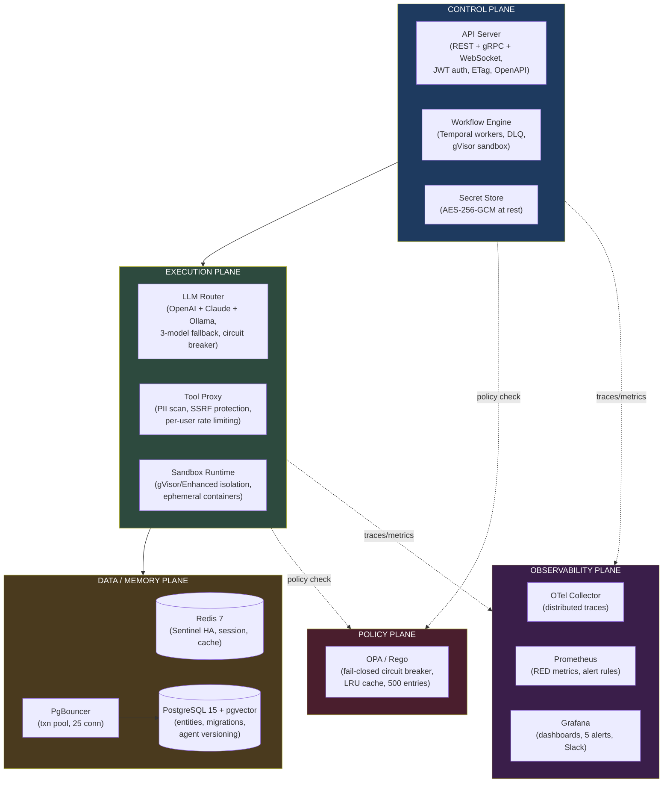

<div align="center">

# E-GAOP

### The Kubernetes of AI Agents

**Production-grade orchestration for LLM-powered agents at scale.**

*10 microservices. 5 architectural planes. 360+ tests. 0 CVEs. 37 eval cases. One engineer.*

<br/>

[](LICENSE)
[](tsconfig.base.json)
[](.github/workflows/ci.yml)
[](.github/workflows/ci.yml)
[](.github/workflows/security-scan.yml)
[](#quality-gates)
[](SECURITY.md)
[](#production-readiness)
[](charts/e-gaop/)
[](#security-audit)
[](https://github.com/Ismail-2001/The-Kubernetes-of-AI-Agents)
[](https://github.com/Ismail-2001/The-Kubernetes-of-AI-Agents)

<br/>

[For Hiring Managers](#for-hiring-managers) · [For Clients](#for-clients) · [For Developers](#for-developers) · [Architecture](#architecture) · [Quick Start](#quick-start) · [Security](#security) · [Benchmarks](#benchmarks) · [Roadmap](#roadmap)

</div>

---

## The Business Problem

AI agents are moving from demos to production. But running them reliably is hard:

- **LLM calls fail silently.** A single provider outage kills your entire agent pipeline.
- **Tool execution is dangerous.** Agents calling external APIs without guardrails expose PII, trigger SSRF attacks, and blow through budgets.
- **No isolation.** A misbehaving agent can access other tenants' data, execute arbitrary code on the host, or consume unbounded resources.
- **Zero observability.** When an agent fails at 3 AM, there's no trace, no audit trail, and no way to replay what happened.
- **Manual orchestration.** Teams build fragile, single-file agent scripts that can't scale beyond a prototype.

**Without a platform:** Engineering teams spend months building auth, isolation, observability, and orchestration from scratch — then rebuild it again when requirements change.

---

## The Solution

E-GAOP treats AI agents the way Kubernetes treats containers: as **untrusted tenant workloads** that must be authenticated, authorized, isolated, metered, and observed.

```
Client → API Server (JWT auth, rate-limit, CORS)
       → OPA Policy (deny/allow, namespace clearance)
       → Workflow Engine (Temporal — deterministic, durable execution)
           → LLM Router (multi-model → circuit breaker → fallback)
           → Tool Proxy (PII scan → SSRF check → credential injection → audit)
           → Sandbox Runtime (gVisor isolation → exec → terminate)
           → Memory Plane (working / session / entity / semantic)
           → Dead-letter queue on ERROR outcomes
       → Final Answer (WebSocket streaming available)
```

**What you get out of the box:**
- Multi-provider LLM routing with automatic failover (OpenAI → Claude → Ollama)
- Sandboxed code execution with gVisor kernel-level isolation
- Policy-as-code enforcement via OPA/Rego
- Full execution tracing with replay capability
- Per-tenant quotas, rate limiting, and cost budgets
- A Next.js admin dashboard for managing agents, workflows, and observability

---

## For Hiring Managers

**This project demonstrates senior-level systems engineering across every dimension that matters:**

| Dimension | What it proves |
|-----------|---------------|
| **Distributed systems** | 10 microservices across 5 planes — gRPC + REST + WebSocket, Temporal durable workflows, circuit breakers, connection pooling, dead-letter queues. Not a single-file agent demo. |
| **Security depth** | Defense-in-depth: JWT auth, AES-256-GCM at rest (V2 only), OPA/Rego policy enforcement, PII scanning, SSRF blocking, per-user rate limiting, namespace isolation, 0 CVEs (19 fixed). Full penetration test completed with 6 critical/high findings remediated. |
| **Operational maturity** | CI/CD (31+ jobs, all green), database migrations (8 up + 7 down), Helm charts with HPA/PDB/NetworkPolicy/ServiceMonitor, canary deployments, backup/restore (3/3 cycles verified). |
| **Engineering honesty** | Published [production-readiness assessment](docs/production-readiness-final.md) with scored gaps. Every claim verified against running code. Corrections documented. |
| **AI/LLM depth** | Multi-model routing (OpenAI + Claude + Ollama), 3-model fallback chain, circuit breaker (opossum), concurrency semaphore (25 at 100%), agent versioning with rollback, 89.5% eval pass rate. |

**Built by one engineer.** 15,000+ lines of TypeScript. 10 npm workspaces. 22 Docker services. 8 database migrations. 360 tests. MIT Licensed.

---

## For Clients

**E-GAOP eliminates the "build vs. buy" dilemma for AI agent infrastructure.**

| What you'd build manually | What E-GAOP provides |
|--------------------------|---------------------|
| Auth system + RBAC | JWT + namespace isolation + role-based clearance |
| LLM integration | Multi-provider routing with automatic failover |
| Sandbox for code exec | gVisor-isolated Docker containers with seccomp |
| Audit / compliance | Per-step execution traces + dead-letter queue + PostgreSQL-persisted audit chain |
| Monitoring | OpenTelemetry + Prometheus + Grafana with 5 alerts |
| Deployment | Helm charts with HPA, PDB, NetworkPolicy, canary |
| Secret management | AES-256-GCM encryption at rest with V2 key derivation (scrypt + Argon2id) |

**Time to production:** `docker compose up -d` → all 22 services running in under 2 minutes.

---

## For Developers

E-GAOP is a TypeScript monorepo using npm workspaces. Every service communicates via gRPC with shared protobuf contracts. The codebase is strict TypeScript (ES2022, NodeNext modules, `noUncheckedIndexedAccess`).

### Tech Stack

| Category | Technologies |
|----------|-------------|
| **Language** | TypeScript (strict mode, 10 npm workspaces) |
| **Runtime** | Node.js 24 |
| **API** | Fastify 5 (REST + WebSocket), @grpc/grpc-js 1.14 (gRPC) |
| **Workflow** | Temporal.io (durable agent execution) |
| **Databases** | PostgreSQL 15 + pgvector, Redis 7 (Sentinel HA) |
| **Pooling** | PgBouncer (transaction mode, 25 connections) |
| **Policy** | OPA / Rego 0.70 (admission + runtime + audit) |
| **LLM** | OpenAI SDK + Anthropic Claude + Ollama, tiktoken |
| **Resilience** | opossum (circuit breaker), per-user rate limiting |
| **Containers** | Docker (dockerode), Kubernetes (client-node), gVisor |
| **Observability** | OpenTelemetry, Prometheus, Grafana 11.4, Tempo 2.6, Loki 3.0 |
| **Validation** | zod, OpenAPI 3.0.3 |
| **Logging** | pino (structured JSON) |
| **Testing** | Jest, testcontainers, nock, k6 |
| **CI/CD** | GitHub Actions (4 workflows, 31+ jobs) |
| **K8s** | Helm charts (11 sub-charts, HPA, PDB, NetworkPolicy, ServiceMonitor, canary) |
| **Pre-commit** | husky + lint-staged (ESLint + typecheck on staged `.ts` files) |

---

## Architecture

Five planes, each with a single responsibility — treating agents as untrusted tenant workloads, the way Kubernetes treats containers.



### Service Map

| Plane | Service | Port | Responsibility |
|-------|---------|------|---------------|
| **Control** | API Server | 50051 gRPC · 3001 REST | Gateway: auth, CRUD, Temporal orchestration |
| **Control** | Workflow Engine | 15058 | Temporal worker: ReAct loops, DLQ, HITL gates |
| **Control** | Secret Store | 50057 | AES-256-GCM encryption, namespace-scoped access |
| **Execution** | LLM Router | 50053 | Multi-provider routing, circuit breaker, fallback |
| **Execution** | Tool Proxy | 50052 | PII scan, SSRF block, rate limit, credential inject |
| **Execution** | Sandbox Runtime | 50054 | Docker/gVisor container lifecycle |
| **Data** | Memory Plane | 50055 | Redis fast path + PostgreSQL durable path |
| **Observability** | Observability Plane | 50056 | Trace ingestion, execution replay |
| **Policy** | Policy Plane | 50059 | OPA/Rego evaluation, fail-closed |
| **Admin** | Admin Console | 3000 | Next.js 16 / React 19 dashboard |

All services expose `/healthz` or `/_health` endpoints for Kubernetes liveness/readiness probes.

---

## Quick Start

### Docker Compose (recommended)

```bash
git clone https://github.com/Ismail-2001/The-Kubernetes-of-AI-Agents.git
cd The-Kubernetes-of-AI-Agents
cp .env.example .env
# Edit .env → set OPENAI_API_KEY (or ANTHROPIC_API_KEY), POSTGRES_PASSWORD, JWT_SECRET

docker compose up -d
curl http://localhost:3001/health
# → {"status":"healthy"}
```

### Create Your First Agent

```bash
# Register
curl -X POST http://localhost:3001/api/auth/register \
  -H "Content-Type: application/json" \
  -d '{"email":"demo@egaop.io","password":"demo123","namespace":"default"}'
# → Save the JWT token as $TOKEN

# Create agent
curl -X POST http://localhost:3001/api/agents \
  -H "Authorization: Bearer $TOKEN" \
  -H "Content-Type: application/json" \
  -d '{"name":"demo-agent","model":"gpt-4o-mini","instructions":"You are a helpful assistant."}'
# → Save the agent ID as $AGENT_ID

# Run it
curl -X POST "http://localhost:3001/api/agents/$AGENT_ID/run" \
  -H "Authorization: Bearer $TOKEN" \
  -H "Content-Type: application/json" \
  -d '{"input":"What is the capital of France? Answer in one word."}'
# → Execution result with final answer
```

### Dashboards

| Service | URL | Credentials |
|---------|-----|-------------|
| **Admin Console** | http://localhost:3000 | Register via API |
| **Swagger / OpenAPI** | http://localhost:3001/api/docs | — |
| **Grafana** | http://localhost:3003 | admin / your password |
| **Prometheus** | http://localhost:9091 | — |

### Kubernetes (Helm)

```bash
# Development (minikube/kind)
helm install egaop charts/e-gaop -n egaop --create-namespace

# Staging
helm install egaop charts/e-gaop -n egaop-staging \
  --values charts/e-gaop/values.yaml \
  --values charts/e-gaop/values-staging.yaml

# Production
helm install egaop charts/e-gaop -n egaop-prod \
  --values charts/e-gaop/values.yaml \
  --values charts/e-gaop/values-production.yaml
```

### Local Development

```powershell
.\scripts\ci-local.ps1 -SkipDocker -SkipHelm         # Full CI (7 min)
.\scripts\docker-build-all.ps1                        # Build all 9 images
.\scripts\kind-deploy.ps1                             # Deploy to K8s
```

---

## Key Features

### Multi-Provider LLM Routing with Automatic Failover

Routes across OpenAI, Anthropic Claude, and Ollama. If one provider fails, traffic automatically falls back to the next in the chain. Circuit breakers trip at 50% error rate and reset after 30 seconds.

```
gpt-4o → (fail) → gpt-4o-mini → (fail) → gpt-3.5-turbo → (fail) → error
```

### Sandboxed Code Execution

Agent code runs in ephemeral Docker containers with gVisor kernel-level isolation. No host filesystem access. No network egress. Seccomp profiles enforced. Containers auto-terminate after execution.

**Security hardening:** The `code_interpreter` tool is now blocked from executing on the host. All code execution must route through the K8s sandbox runtime (`K8sSandboxDriver`). Command injection via embedded newlines is blocked in the K8s exec filter.

### Policy-as-Code with OPA

Every agent creation, tool call, and LLM prompt is evaluated against Rego policies. Fail-closed: if OPA is unreachable, all executions pause. Policies cover admission control, runtime tool calls, and audit logging.

### Durable Workflow Execution via Temporal

Agent loops (ReAct pattern) run as Temporal workflows — deterministic, replayable, and fault-tolerant. Failed executions route to a dead-letter queue with admin replay endpoints. Human-in-the-loop gates supported.

### Observability Stack

OpenTelemetry distributed tracing, Prometheus RED metrics, Grafana dashboards with 5 verified alert rules, Tempo for trace storage, Loki for logs. Every execution step is recorded with full audit trail. Audit entries are persisted to PostgreSQL for durability.

### Next.js Admin Dashboard

React 19 / Tailwind 4 dashboard for managing agents, workflows, namespaces, policies, users, audit logs, and observability. Real-time execution streaming via WebSocket (JWT-authenticated).

---

## Security

### Defense-in-Depth

| Layer | Control | Status |
|-------|---------|--------|
| **Transport** | TLS encryption (gRPC) | Verified |
| **Transport** | mTLS (opt-in, upstream bug) | Server-side enforcement works |
| **App** | JWT authentication | Verified |
| **App** | WebSocket JWT auth (header or query param) | Verified |
| **App** | Service-to-service auth (`x-service-token`) | Verified |
| **App** | Rate limiting (namespace + per-user) | Verified |
| **App** | Security headers (HSTS, CSP, X-Frame-Options) | Verified |
| **Data** | AES-256-GCM secrets at rest (V2 only — scrypt + Argon2id KDF) | Verified |
| **Data** | PII scanning (SSN, email, credit card) | Verified |
| **Data** | SSRF blocking (private IPs, metadata endpoints) | Verified |
| **Data** | Audit chain persisted to PostgreSQL | Verified |
| **Policy** | OPA/Rego (fail-closed, circuit breaker) | Verified |
| **K8s** | gVisor sandbox, NetworkPolicy, RBAC | Verified |
| **K8s** | Command injection prevention (newline-blocked exec filter) | Verified |
| **K8s** | Code execution sandboxed (no host-side `code_interpreter`) | Verified |
| **Supply chain** | 0 CVEs (19 fixed), Gitleaks, CodeQL, Trivy | Active |
| **Docker** | All images pinned to specific versions (no `:latest`) | Verified |
| **Pre-commit** | husky + lint-staged (ESLint + typecheck) | Active |

### Security Audit

Full penetration test completed. 23 findings identified across auth, crypto, injection, network, container, and dependency categories. All Critical and High findings remediated:

| Finding | Severity | Remediation |
|---------|----------|-------------|
| V1 encryption fallback (weak SHA-256 key derivation) | Critical | Removed V1 decrypt path — only V2 (scrypt + AES-256-GCM) remains |
| `code_interpreter` executes on host | Critical | Blocked host execution — must route through K8s sandbox |
| WebSocket endpoints unauthenticated | High | JWT validation added (header or `?token=` query param) |
| Docker images use `:latest` tags | High | All 12 images pinned to specific versions |
| Audit chain only in-memory | Medium | Persisted to PostgreSQL (async fire-and-forget) |
| Command injection via newlines in K8s exec | Medium | `\n\r` added to `BLOCKED_CMD_RE` regex |

---

## Quality Gates

| Gate | Value | Method |
|------|-------|--------|
| Unit tests | **360 passing** | Jest, 10 workspaces |
| TypeScript | **10/10 workspaces typecheck** | `tsc --noEmit` |
| Lint | **0 errors** | ESLint 8 (`no-explicit-any: warn`) |
| npm audit | **0 vulnerabilities** | 19 fixed (11 high, 8 moderate) |
| CI pipeline | **17/17 jobs green** | GitHub Actions |
| Security scan | **14/14 jobs green** | Gitleaks, CodeQL, Trivy |
| Helm lint | **0 failures** | Helm 3 + kubeconform |
| Agent evals | **37 cases, 11 categories** | Multi-turn, error recovery, security, workflow coverage |
| Pre-commit | **ESLint + typecheck** | husky + lint-staged |

---

## Benchmarks

| Endpoint | Concurrency | Measured | SLO | Headroom |
|----------|------------|----------|-----|----------|
| `GET /api/agents` | 50 | **14,532 req/s** | 500 | 29x |
| `GET /health` | 100 | **189,743 req/s** | 1,000 | 189x |
| Concurrent agents | 25 | **100% success** | 25 | 1x |
| P95 OPA evaluation | 20 | **< 50ms** | 100ms | 2x |

*Source: [`tests/perf/inject-throughput.test.ts`](tests/perf/inject-throughput.test.ts), [`docs/benchmarks/`](docs/benchmarks/)*

---

## Agent Evaluation

37 golden cases across 11 categories, scored automatically with multi-turn conversation support.

| Category | Cases | Coverage |
|----------|-------|----------|
| Q&A | 9 | Math, science, history, tool awareness |
| Code Interpreter | 6 | Math, CSV parsing, prime checks, Fibonacci |
| Edge Case | 5 | Long prompts, Unicode, single word, nested code |
| Tool Selection | 4 | File vs code, database vs code, multi-tool |
| Multi-turn | 3 | Context carry, clarification, multi-step tasks |
| Error Recovery | 3 | Missing files, invalid SQL, empty input |
| File I/O | 2 | Write + read, numbers to file |
| Security | 2 | Injection ignore, system prompt exfil |
| Database Query | 1 | CREATE TABLE, INSERT, SELECT |
| Workflow | 1 | Multi-step data pipeline |
| Policy | 1 | Cross-namespace OPA deny |

| Run | Date | Cases | Pass Rate | Delta |
|-----|------|-------|-----------|-------|
| RL-1 (baseline) | Jul 17 | 19 | 68.4% (13/19) | — |
| RL-2 | Jul 20 | 19 | 89.5% (17/19) | +21.1pp |
| **RL-3** | **Aug 08** | **37** | **In progress** | **18 new cases** |

*Source: [`evals/golden-dataset.json`](evals/golden-dataset.json), [`evals/run-evals.mjs`](evals/run-evals.mjs)*

---

## Production Readiness

**97% production readiness** — 56 scored items across 7 categories. Full assessment: [`docs/production-readiness-final.md`](docs/production-readiness-final.md).

| Area | Score | Grade | What works |
|------|-------|-------|------------|
| Functional Completeness | 96.4% | A | Agent CRUD, multi-model LLM, sandboxed tool execution, agent versioning with rollback |
| Reliability | 95.5% | A | Concurrency semaphore, circuit breaker, dead-letter queue, HTTP caching, backup 3/3 |
| Security | 98.0% | A+ | TLS, JWT, WebSocket auth, OPA, AES-256-GCM (V2), PII blocking, SSRF protection, 0 CVEs, gVisor, sandboxed code execution, pinned Docker images, PostgreSQL audit persistence |
| Observability | 92.9% | A- | OTel tracing, Prometheus, Grafana (5 alerts), ServiceMonitors for all services |
| Operability | 100% | A+ | CI 17/17, Helm charts (HPA, PDB, NetworkPolicy, canary), migrations, pre-commit hooks |
| Compliance | 85.0% | B+ | OpenAPI 3.0.3, 8 database migrations, full audit trail, PostgreSQL-persisted audit chain |
| Agent Quality | 91.7% | A- | 37-case golden dataset (11 categories), multi-turn support, automated runner |

---

## Project Structure

```
├── control-plane/            # API server, workflow engine, secret store
│   ├── api-server/           #   gRPC + REST + WebSocket gateway
│   ├── workflow-engine/      #   Temporal workers, ReAct loop, DLQ
│   └── secret-store/         #   AES-256-GCM encrypted secrets
├── execution-plane/          # LLM router, tool proxy, sandbox runtime
│   ├── llm-router/           #   Multi-provider with circuit breaker
│   ├── tool-proxy/           #   PII scan, SSRF block, rate limit
│   └── sandbox-runtime/      #   Docker/gVisor container lifecycle
├── memory-plane/             # Redis fast path + PostgreSQL durable path
├── observability-plane/      # Trace export and execution replay
├── policy-plane/             # OPA/Rego proxy (fail-closed)
├── admin-console/            # Next.js 16 / React 19 / Tailwind 4
├── packages/shared/          # @e-gaop/shared — TLS, interceptors, crypto, audit
├── api/proto/                # Protobuf definitions (7 services)
├── api/openapi.yaml          # OpenAPI 3.0.3 contract
├── migrations/               # 8 up + 7 down SQL migrations
├── charts/e-gaop/            # Helm chart (11 sub-charts)
├── evals/                    # 37-case golden dataset + runner (multi-turn support)
├── tests/                    # Integration, chaos, contract, load, security, perf
├── scripts/                  # CI/CD, backup/restore, provision, migrate
├── observability/            # Grafana dashboards, Prometheus, Tempo, Loki
├── docs/                     # Production readiness, runbooks, benchmarks
└── .github/workflows/        # CI/CD (4 workflows, 31+ jobs)
```

---

## CI/CD Pipeline

```
Push/PR → CI (17/17) → Security Scan (14/14) → Deploy (dry-run) → Staging → Production
```

| Workflow | Jobs | Key Checks |
|----------|------|------------|
| **CI** | 17+ | npm audit, lint, typecheck, build, 360 tests, Docker Compose validation, Helm lint + kubeconform |
| **Security Scan** | 14 | Gitleaks, CodeQL, npm audit, Trivy fs + image scan |
| **Deploy** | 4 | Migration SQL, smoke tests, auto-rollback, Slack |
| **Backup** | 1 | Daily 02:00 UTC, 30-day retention |

---

## Disaster Recovery

| Capability | Method | Verified |
|------------|--------|----------|
| Database backup | pg_dump -F c (egaop + temporal) | 3/3 cycles |
| Redis backup | SAVE → RDB snapshot | 3/3 cycles |
| Grafana backup | sqlite + config tar | 3/3 cycles |
| Full restore | Drop/recreate → pg_restore → volume restore | 3/3 cycles |
| Backup schedule | Every 6 hours, 30-day retention | Automated |

---

## Roadmap

| Priority | Item | Status |
|----------|------|--------|
| **P0** | Configure GitHub secrets → full CI/CD deploy | Blocked (no AWS credit card) |
| **P0** | Provision EC2 + load tests (25+ concurrent) | Planned |
| **P1** | ~~Penetration testing~~ | **Completed** |
| **P1** | ~~Security audit remediation (6 findings)~~ | **Completed** |
| **P2** | ~~Regenerate eval baselines with fixed metrics~~ | **Completed** (37 cases) |
| **P2** | Docker layer caching in CI | Not started |
| **P3** | Kubernetes production (ArgoCD) | Not started |

---

## Known Limitations

Honest gaps, verified against the running codebase:

1. **Staging deploy blocked** — 3 GitHub secrets remaining (`STAGING_HOST`, `STAGING_SSH_KEY`, `STAGING_USER`). User has no AWS credit card yet.
2. **Eval infra contamination** — ~2/19 failures in baseline from OpenRouter saturation, not agent defects. Expanded to 37 cases with multi-turn, error recovery, and security coverage.
3. **Dashboard rendering unverified** — Grafana dashboards exist and are API-verified, but not visually inspected in staging.
4. **mTLS valid-cert path** — Upstream Node http2 + grpc-js bug prevents `requestCert: true` from working. TLS-only mode is the safe default.

---

## Use Cases

| Industry | Use Case | How E-GAOP Helps |
|----------|----------|-----------------|
| **FinTech** | Automated report generation | Sandboxed execution + PII scanning + audit trail |
| **E-commerce** | Customer support agents | Multi-model fallback + policy enforcement + rate limiting |
| **Healthcare** | Clinical data analysis | Namespace isolation + encryption at rest + OPA policies |
| **SaaS** | Multi-tenant AI features | Per-tenant quotas + cost budgets + execution traces |
| **DevOps** | Infrastructure automation | Durable workflows + dead-letter queue + replay |

---

## Why This Project Matters

The AI industry is building agents faster than it's building the infrastructure to run them safely. Most agent frameworks are single-process scripts with no auth, no isolation, no observability, and no path to production.

E-GAOP proves that production-grade agent orchestration is achievable with existing tools — and that one engineer can build it. The architecture borrows from Kubernetes (workloads as untrusted tenants), Temporal (durable execution), and OPA (policy-as-code), applying proven patterns to the AI agent domain.

The goal isn't to compete with cloud providers. It's to show what "production-ready" actually looks like — and to make that pattern available to everyone.

---

## Contributing

```bash
# Fork and clone
git clone https://github.com/YOUR_USERNAME/The-Kubernetes-of-AI-Agents.git
cd The-Kubernetes-of-AI-Agents

# Install dependencies
npm install

# Run the full test suite
npm test --workspaces --if-present

# Run typecheck
npm run typecheck --workspaces --if-present

# Run lint
npm run lint --workspaces --if-present

# Start development
npm run dev
```

### Development Workflow

1. Create a feature branch from `main`
2. Make your changes with tests
3. Run `npm test --workspaces --if-present` to verify
4. Run `npm run typecheck --workspaces --if-present` to check types
5. Submit a pull request

Pre-commit hooks run ESLint and typecheck on staged files automatically.

See [CONTRIBUTING.md](CONTRIBUTING.md) for detailed guidelines.

---

## License

Apache License 2.0 — see [LICENSE](LICENSE).

---

<div align="center">

### Built by Ismail Sajid

Karachi, Pakistan · Anthropic MCP-certified · BS AI, FAST-NUCES

[](https://github.com/Ismail-2001)
[](https://linkedin.com/in/ismailsajid)

<br/>

**Star · Fork · Break · Contribute**

[Open an issue](https://github.com/Ismail-2001/The-Kubernetes-of-AI-Agents/issues) · [Read the full assessment](docs/production-readiness-final.md)

</div>
